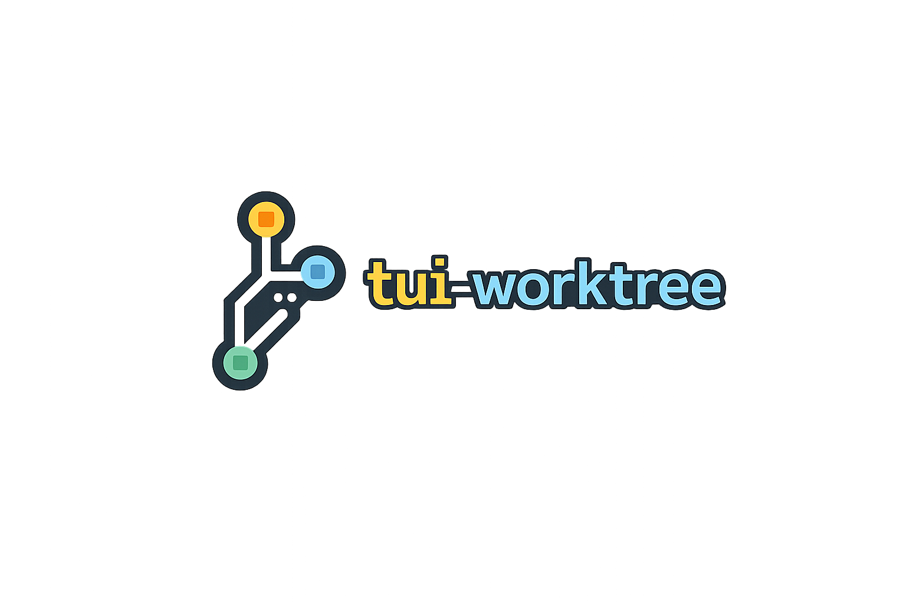

# tui-worktree

<p align="center">
  
</p>

## Project overview

`tui-worktree` helps you review AI-generated work without losing your place.

When you work with tools like **Superpower**, the AI can create useful changes quickly, but reviewing those changes can still feel scattered. You may need to jump between worktrees, file lists, editor tabs, and `git diff` just to answer a simple question: "What changed, and do I trust it?"

`tui-worktree` puts that review in one place. You can move through worktrees, see changed files, read the diff, filter by path, and open the exact file you care about without breaking flow.

It is built to make **Superpower-driven coding sessions** easier to trust: keep generated work isolated in worktrees, inspect every change from one focused TUI, then decide whether to merge, continue, or delete it.

The project is written in Go and uses Bubble Tea, Bubbles, and Lip Gloss for the TUI.

## Why this exists

AI coding is most useful when the user can review the result comfortably. If the review step is noisy, slow, or hard to follow, it becomes difficult to trust the work even when the code might be good.

This app is meant to be the comfortable viewing layer between AI work and your next decision. It makes it easier to scan, compare, and inspect changes before you hand them off to merge, continue editing, or throw them away.

## Features

- Browse linked Git worktrees and their changed files
- Review file diffs with wrapping, line numbers, syntax-aware highlighting, and scroll preservation during refreshes
- Auto-refresh worktree changes every 5 seconds
- Open the selected file in `$EDITOR` near the first changed line when the editor supports line arguments
- Create PRs/MRs through `gh` or `glab`
- Merge a selected worktree branch into another worktree branch
- Delete non-protected worktrees and branches after confirmation
- Switch and persist themes from inside the TUI
- Use transparent theme backgrounds when your terminal already provides the desired background
- Protect current/default worktrees and protected branch names from destructive actions

## Installation

Requirements:

- Git
- Homebrew, or Go 1.26.2 or newer for `go install`
- A terminal with truecolor support
- Optional: `gh` or `glab` for PR/MR creation

Install with Homebrew:

```bash
brew install overthinker1127/tap/tui-worktree
```

Install Linux packages from a GitHub release by downloading the package for your version and architecture first:

```bash
version=v0.0.10
curl -LO "https://github.com/overthinker1127/tui-worktree/releases/download/${version}/tui-worktree_${version#v}_amd64.deb"
sudo apt install "./tui-worktree_${version#v}_amd64.deb"
```

For RPM or Alpine packages, download the matching asset from the same release page:

```bash
version=v0.0.10
curl -LO "https://github.com/overthinker1127/tui-worktree/releases/download/${version}/tui-worktree-${version#v}-1.x86_64.rpm"
sudo rpm -i "./tui-worktree-${version#v}-1.x86_64.rpm"

curl -LO "https://github.com/overthinker1127/tui-worktree/releases/download/${version}/tui-worktree_${version#v}_x86_64.apk"
sudo apk add --allow-untrusted "./tui-worktree_${version#v}_x86_64.apk"
```

Chocolatey packages are generated as release assets. After the package is published to the Chocolatey Community Repository:

```powershell
choco install tui-worktree
```

Or install with Go:

```bash
go install github.com/overthinker1127/tui-worktree/cmd/tui-worktree@latest
```

When installing with Go, make sure your Go binary directory is on `PATH`. Common locations are `$(go env GOPATH)/bin` or `GOBIN` when configured.

## Usage examples

Open the current repository:

```bash
tui-worktree
```

Open another repository:

```bash
tui-worktree --repo /path/to/repo
```

Use a specific theme for one run:

```bash
tui-worktree --theme kanagawa
```

Use your terminal background instead of theme-painted backgrounds:

```bash
tui-worktree --transparent
```

You can also press `t` in the TUI and choose `Transparent background` at the top of the theme list.

Show help:

```bash
tui-worktree --help
```

Common key bindings:

- `1` / `2` / `3`: focus worktrees, files, or diff panel
- `tab` / `shift+tab`: next or previous worktree
- `j` / `down`: next item or scroll diff down
- `k` / `up`: previous item or scroll diff up
- `/`: filter changed files by path; `esc` clears the filter
- `g` / `home`: first file, or top of diff when diff is focused
- `G` / `end`: last file, or bottom of diff when diff is focused
- `e`: open selected file in `$EDITOR`
- `p`: create a PR/MR with `gh` or `glab`
- `d`: delete selected worktree and branch after confirmation
- `m`: merge the selected worktree branch into a selected target branch
- `w`: toggle diff wrap
- `n`: toggle diff line numbers
- `t`: open theme picker
- `q` / `ctrl+c`: quit

## Configuration

The app stores user configuration at:

```text
~/.config/tui-worktree/config.json
```

Theme and transparent background changes made from the TUI are saved there automatically. The `--theme` flag overrides the saved theme for the current run only. The `--transparent` flag keeps theme foreground colors but lets your terminal background show through.

Editor integration uses `$EDITOR`. Known editor families receive line hints for the first changed line:

- Vim-style editors: `vi`, `vim`, `nvim`, `nano`, `micro`, `emacs`
- VS Code-style editors: `code`, `code-insiders`, `codium`, `vscodium`, `cursor`, `windsurf`
- Path-with-line editors: `zed`, `subl`, `hx`, `helix`
- JetBrains launchers: `idea`, `goland`, `webstorm`, `pycharm`, `clion`, `rider`

Unknown editors still open the selected file without a line hint.

## Development

Run the app from source:

```bash
go run ./cmd/tui-worktree --repo /path/to/repo
```

Format, tidy, and test:

```bash
gofmt -w ./cmd ./internal
go mod tidy
go test ./...
go vet ./...
```

Build a local release snapshot:

```bash
goreleaser release --snapshot --clean --skip=publish,chocolatey
```

The compatibility command is available at:

```bash
go run ./cmd/worktree-diff-tui --repo /path/to/repo
```

## License

This project is licensed under the MIT License. See [LICENSE](LICENSE).

Third-party dependency license notices are included under
[third_party/licenses](third_party/licenses).
